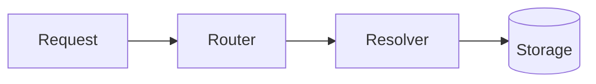
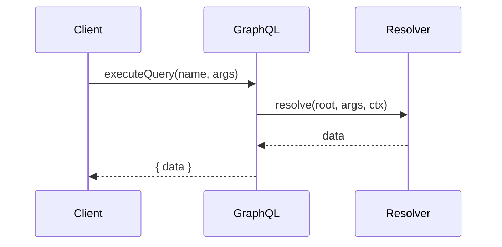
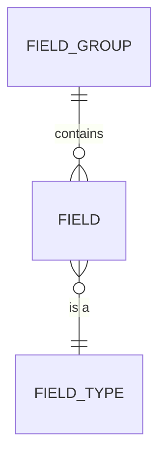
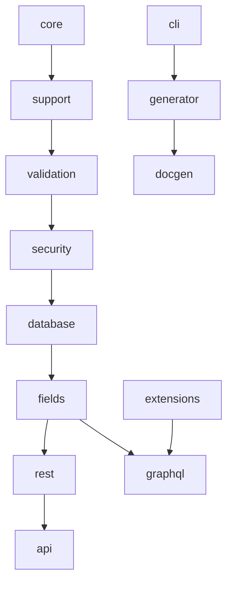

# Diagram Standards

Diagrams are **code, not images**: author them in
[Mermaid](https://mermaid.js.org) inside fenced blocks so they are diffable,
reviewable, and render on GitHub. This document defines the standards — it does
not generate images.

Related: [STYLE_GUIDE.md](./STYLE_GUIDE.md) · [architecture/](./architecture/).

---

## Rules

- Prefer **inline Mermaid** in the page. Store standalone sources under
  `assets/diagrams/*.mmd` when reused across pages.
- Use ` ```mermaid ` fences. Keep node labels short; link long detail in prose.
- Left-to-right (`LR`) for pipelines/dependencies; top-down (`TD`) for hierarchies.
- Follow the framework's dependency direction (see
  [ARCHITECTURE.md](../ARCHITECTURE.md)); never draw an arrow uphill.
- Provide a one-line caption under each diagram (acts as alt text).

## Supported types & templates

### Flowchart



### Sequence



### Entity relationship



### Package / dependency graph



## Do / don't

- ✅ One idea per diagram; split large graphs.
- ✅ Match node names to real class/package names.
- ❌ No screenshots of diagrams; no binary diagram formats.
- ❌ No color as the only signal (dark-mode + accessibility).
