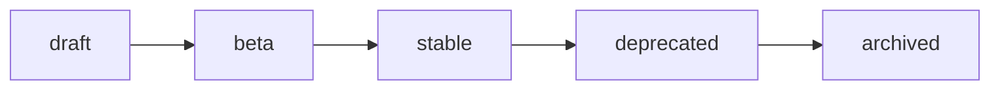

# Documentation Versioning Strategy

Documentation is versioned alongside the framework (SemVer —
[ADR-0019](./adr/ADR-0019-versioning.md)). Older versions remain accessible.

Related: [release-milestones.md](./roadmap/release-milestones.md) ·
[FRONTMATTER.md](./FRONTMATTER.md) · [GOVERNANCE.md](./GOVERNANCE.md).

---

## Version lines

| Line | Meaning | Docs branch/label |
| ---- | ------- | ----------------- |
| **Development** | Unreleased `main`/`develop` | `next` |
| **Alpha** | `v0.1`–`v0.9` foundation trains | `v0.x` |
| **Beta** | `v0.10`–`v0.16` (Builder → Release Engineering) | `v0.x` |
| **Stable** | `v1.0.0` | `v1.x` |
| **LTS** | Designated stable lines with extended support | `v1.x` (LTS-tagged) |

The `version` frontmatter field records which line a page targets (`next`,
`v0.x`, `v1.x`).

## How versions are captured

- The **living docs** (this tree) always describe the current development line
  (`next`).
- On each stable release, the docs are **snapshotted** to a versioned path
  (e.g. `v1.x/`) so prior versions stay reachable. Snapshotting/publishing is
  **Phase 18 (Release Engineering)**; this phase only defines the strategy.
- The [changelog](./reference/changelog.md) is generated from the root
  `CHANGELOG.md`; migration guides live under [release/](./release/README.md).

## Page lifecycle

- `draft` — in progress; not linked from indexes.
- `beta` — usable; API may still shift.
- `stable` — matches a released version.
- `deprecated` — superseded; keeps a link to the replacement (kept for one
  minor line, then archived).
- `archived` — moved under a version snapshot; excluded from the current search
  index.

## Compatibility notes

- A page describing behavior that differs by version must state the version
  explicitly (e.g. "Since `v0.13`").
- Removed/renamed public API is recorded by the backward-compatibility baseline
  (`composer bc:check`) and, when a break is accepted, in a migration guide.
