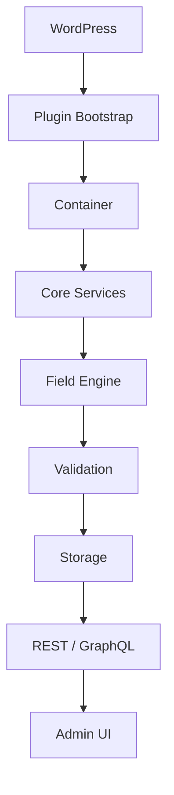
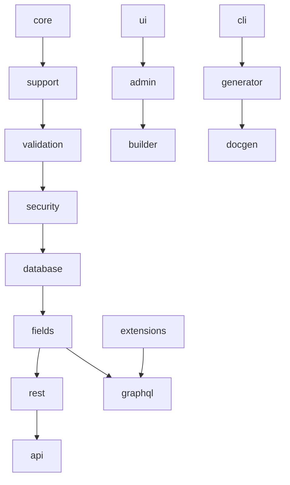

# Architecture Overview

OpenMeta is a modular, layered architecture with clear boundaries between
presentation, application services, domain logic, and storage. The full
document is [ARCHITECTURE.md](../../ARCHITECTURE.md); this page is the concept
summary.

## Layers

## Dependency direction

A package may depend only on packages **above** it, never below:

- ✅ `fields` may use `database`, `validation`, `security`, `support`, `core`.
- ❌ `core` must not import `support`; `database` must not import `fields`.
- `wordpress` is outermost glue (bridges only); `framework` aggregates all.

New dependency edges update the package `SPEC.md` first, then the code. See the
Cursor rule `dependency-rules` and each package's SPEC.

## Package strategy

Each package isolates one capability and shares contracts through
[`core`](../packages/core.md). Only documented public APIs are consumed by
extensions.

## Related

- [Philosophy](./philosophy.md) · [Dependency Injection](./dependency-injection.md)
- [ADR-0002](../adr/ADR-0002-architecture-style.md) · [Packages](../packages/README.md)

## Next steps

- [Dependency Injection](./dependency-injection.md)
- [Service Providers](./service-providers.md)
