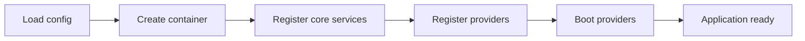

# Lifecycle

Booting the framework is a fixed, idempotent sequence driven by the kernel.



## The one-call path

```php
use OpenMeta\Core\Bootstrap\Bootstrap;

$app = Bootstrap::run($config, $providers);   // runs the whole sequence
$app->isBooted(); // true
```

Or the batteries-included [`framework`](../packages/framework.md) meta package:

```php
$app = \OpenMeta\Framework\Framework::boot();
```

## Kernel phases

The kernel moves through `Pending → Bootstrap → Initialize → Ready`. All
providers' `register()` methods run before any `boot()`, so a provider's
`boot()` may safely resolve bindings created by any other provider (see
[Service Providers](./service-providers.md)).

## Guidelines

- Bootstrap must remain **idempotent** and fail safely when requirements are not
  met.
- Do domain work in `boot()`, not at file load time.

## Related

- [Service Providers](./service-providers.md) · [Configuration](./configuration.md)
- [core package](../packages/core.md)

## Next steps

- [Packages guide](../packages/README.md)
